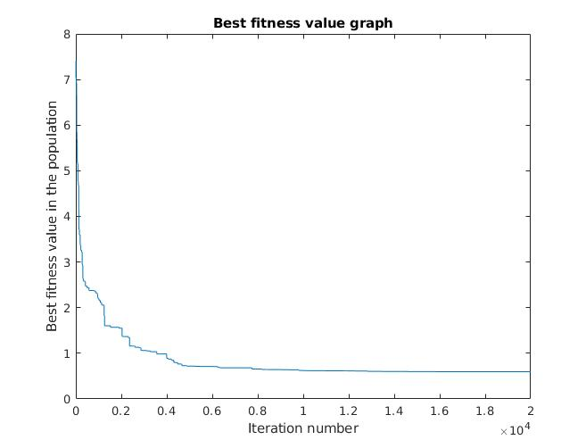
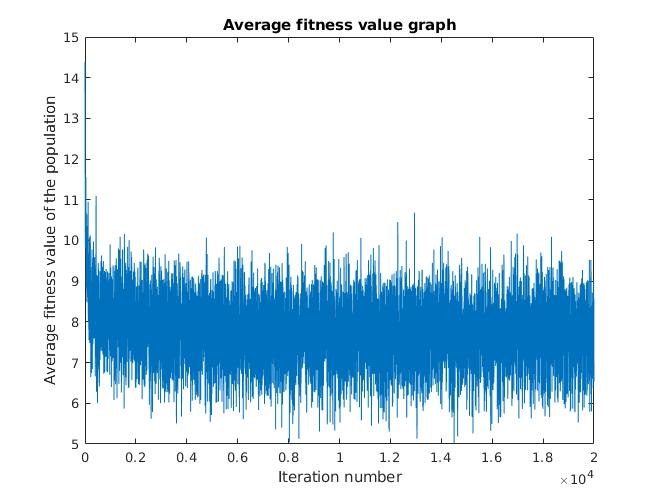
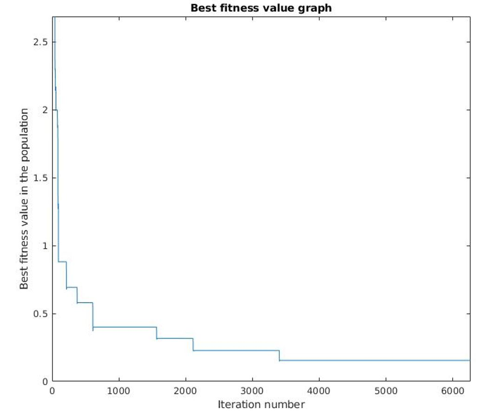
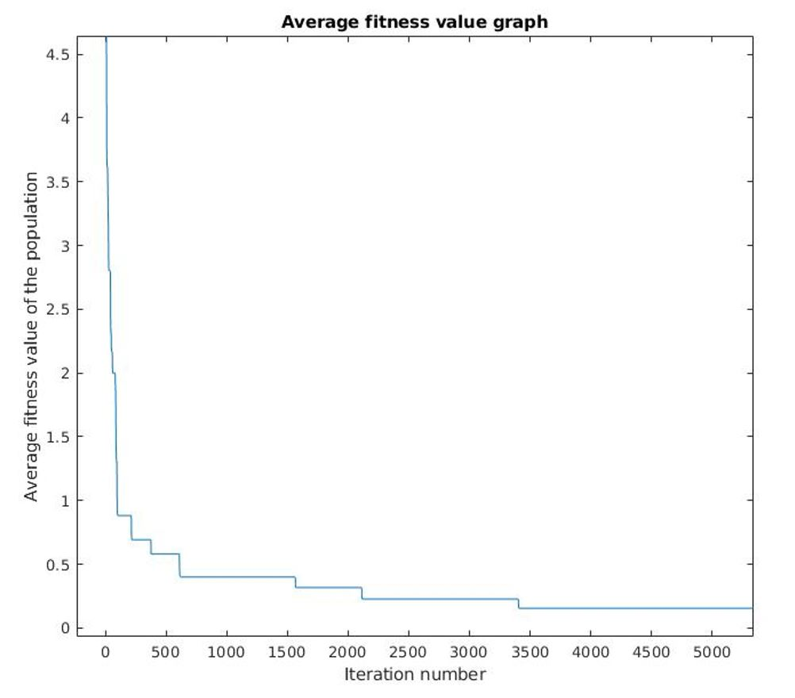

# evolutionary computing
**genetic algorithms** and **evolutionary strategy** implementation to solve Ackley function

## Sample run

**1. Genetic Algorithm**
------------------
**Total iteration:** 20.000  
**Population size:** 30  
**Mutation probability:** 1/(population size * (# of bits per gene))  

**2. Evolutionary Strategy**
------------------
**Total iteration:** 30.000  
**Population size:** 30  
**Offspring size:** 200  
**Thao:** sqrt(1/ (# of variable))  
**Mutation probability:** 0.5  

